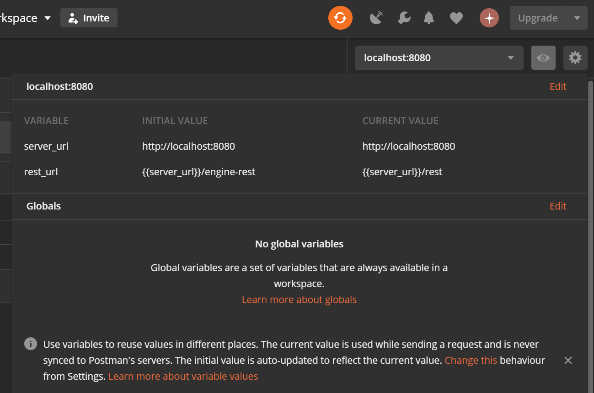

# camunda-rest-postman

A Postman collection for the Camunda BPM REST API.

Set the _**server_url**_ and _**rest_url**_ variables in the Postman environment to configure the target environment. For instance 

http://localhost:8080/rest (Spring Boot)

http://localhost:8080/engine-rest (Maven archetypes)



(@see https://learning.getpostman.com/docs/postman/variables-and-environments/variables/#understanding-variables-and-environments)

Postman:
https://www.getpostman.com/

Camunda REST API documentation:
https://docs.camunda.org/manual/latest/reference/rest/

Camunda REST API tutorial on youtube:
https://youtu.be/ypX90aQScOQ

